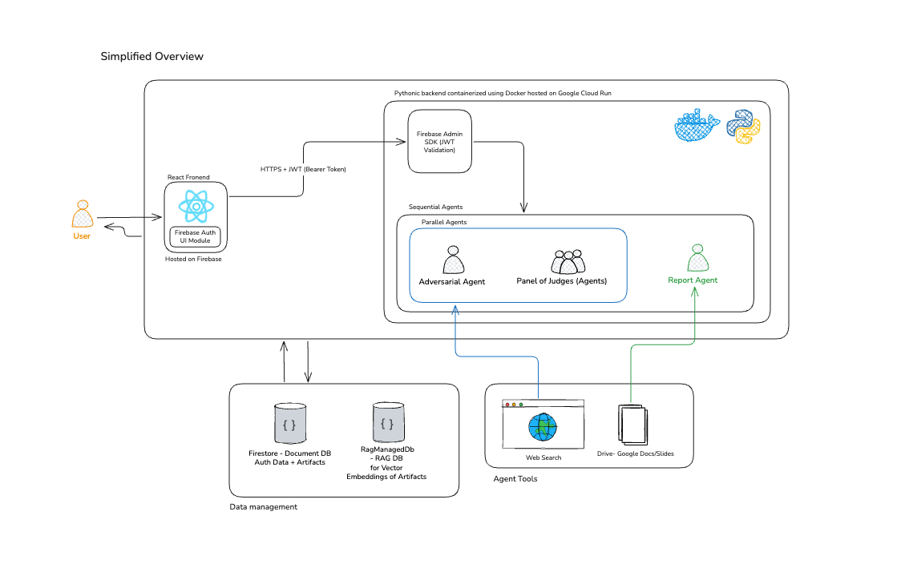
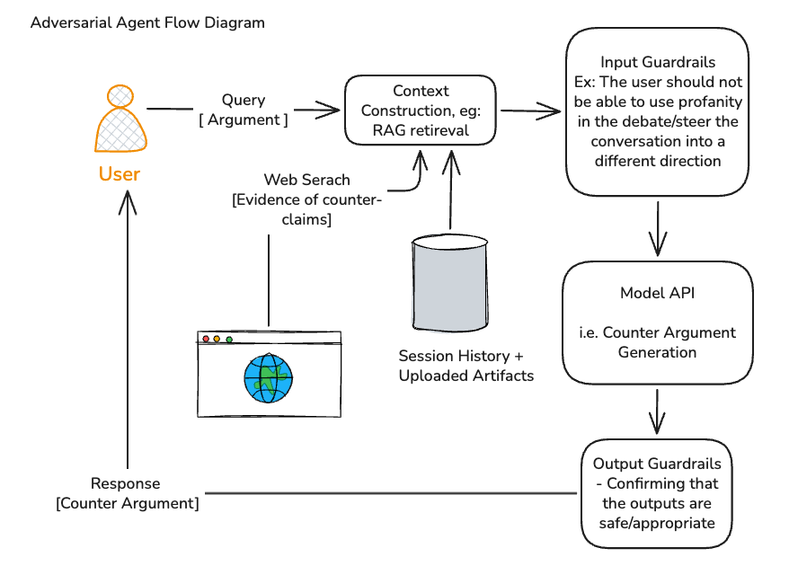
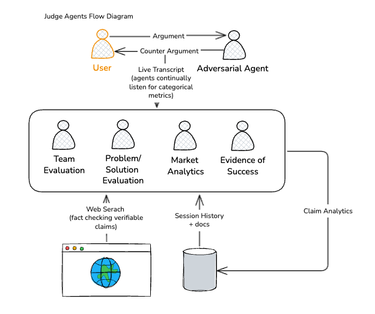
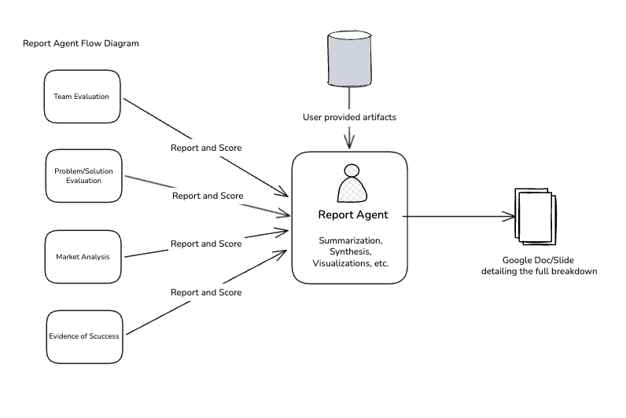

# 👹 Devil's Advocate

**Devil's Advocate** is a live voice AI debate system for stress-testing startup ideas. A founder presents an idea, the agent pushes back in real time with grounded counterarguments, and the app finishes with a judge scorecard plus a post-debate report.

Built for the **Google Gemini Live Agent Challenge** and for **UIUC CS 568 (User-Centered Machine Learning)** as a research prototype exploring whether adversarial AI feedback improves early-stage startup refinement.

## For Judges

- **Live demo:** [devils-advocate-488918.web.app](https://devils-advocate-488918.web.app/)
- **Architecture PDF:** [docs/arch_diagram.pdf](docs/arch_diagram.pdf)
- **Best quick demo path:** enter a startup idea, debate the live agent, then review the scorecard and post-debate report

What to expect from the product:

1. Start with a typed startup claim or upload supporting documents.
2. Debate a live Gemini-powered agent that challenges weak assumptions in real time.
3. Review tracked claim behavior, a judge scorecard, and a final recommendation report.

## Why This Matters

Founders often get weak, biased, or overly supportive feedback when testing early ideas. Devil's Advocate is designed to create a sharper feedback loop: instead of encouragement-first brainstorming, the user has to defend their assumptions out loud against a skeptical live agent. That makes the experience useful both as a founder tool and as a CS 568 research prototype for studying adversarial AI feedback.

## What The Product Does

- Runs a fully spoken, interruptible debate using the Gemini Live API.
- Grounds the agent with a startup knowledge base, uploaded founder documents, and Google Search.
- Tracks whether the founder defended, conceded, deflected, or introduced a new claim.
- Generates a judge scorecard and a post-debate gap analysis at the end of the session.
- Logs sessions to Firebase for research when consent is enabled.

## How It Works

1. The founder enters a position or uploads a pitch deck, business plan, or related materials.
2. The frontend authenticates the user, uploads files, and starts a live Socket.IO session.
3. The backend validates the request, retrieves startup context, summarizes uploaded materials when needed, and prepares the Gemini debate prompt.
4. During the debate, Gemini Live handles the voice interaction while lightweight Gemini flows classify turns, summarize claims, and support downstream evaluation.
5. At the end of the session, the app produces a judge scorecard and a final report highlighting strengths, weaknesses, and next steps.

## Architecture

### Overall System



### Live Debate Agent Flow



### Judge Flow



### Report Flow



## Tech Stack

| Layer | Technology |
|---|---|
| Frontend | React, Vite, Firebase Web SDK |
| Backend | FastAPI, python-socketio |
| AI | Gemini Live API, Gemini Flash Lite |
| Retrieval | ChromaDB + uploaded document chunks |
| Auth / Storage | Firebase Auth, Firebase Storage |
| Logging | Firestore |
| Hosting | Firebase Hosting, Cloud Run |
| Local Python Workflow | `uv` + `requirements.txt` |

## Repo Layout

```text
frontend/          React + Vite app
backend/           FastAPI + Socket.IO backend
tests/backend/     Backend unit and integration tests
docs/              Architecture diagrams and supporting submission materials
```

## Submission Checklist

For the Gemini Live Agent Challenge / Devpost submission, this repo supports:

- Public code repository with reproducible local setup instructions.
- Clear description of Gemini, Firebase, and Google Cloud usage.
- Architecture diagram: [docs/arch_diagram.pdf](docs/arch_diagram.pdf).
- Public demo link: [devils-advocate-488918.web.app](https://devils-advocate-488918.web.app/).
- Demo video showing the real live-agent workflow, not mockups.
- Proof-of-deployment recording showing the deployed frontend plus the Google Cloud backend or service view.

## Developer Setup

If you are reviewing the submission, the live deployment above is the fastest way to experience the project. The rest of this section is for developers who want to run the repo locally.

### Prerequisites

- Python 3.11, 3.12, or 3.13
- [uv](https://docs.astral.sh/uv/) for Python environment management
- Node.js 18+
- npm

Optional but useful:

- Firebase CLI for Hosting deploys
- Google Cloud CLI for Cloud Run work

Avoid Python 3.14 for now. `chromadb` in the current dependency set is not fully compatible with it in local tests.

### Access You Need

To run the full system locally, you need access to the shared Firebase and Google Cloud project resources:

- Firebase web app config values for the frontend
- A Gemini API key for backend agent flows
- A Firebase Admin SDK service account JSON for local backend access
- Firestore and Firebase Storage access
- Firebase Auth providers enabled for `Anonymous`, `Google`, and `GitHub`
- Authorized Firebase Auth domains for `localhost`, `127.0.0.1`, and the deployed hosting domains

### Local Cost Isolation

If you manually test full debates locally with the shared Firebase and Gemini credentials, you will still hit the shared project resources and billing surfaces. Static checks, mocked tests, and frontend unit tests are low risk; real end-to-end sessions are not.

To isolate local testing onto your own project instead of the shared deployment resources, swap these values before running the app:

- `frontend/.env.local`: your own Firebase web app config values
- `backend/.env`: your own `GEMINI_API_KEY`, `FIREBASE_KEY_PATH`, and `FIREBASE_STORAGE_BUCKET`
- `backend/firebase_key.json`: your own Firebase Admin SDK service account JSON, or another path referenced by `FIREBASE_KEY_PATH`

Your Firebase project also needs Firestore enabled, Firebase Storage enabled, Auth providers for `Anonymous`, `Google`, and `GitHub` if you want parity, and authorized domains for `localhost` and `127.0.0.1`.

### 1. Clone The Repo

```bash
git clone https://github.com/josephstefurak/devils-advocate.git
cd devils-advocate
```

### 2. Set Up The Backend

Create a local virtual environment and install both runtime and test dependencies:

```bash
uv venv .venv
source .venv/bin/activate
uv pip install -r backend/requirements.txt -r requirements-dev.txt
```

Create the backend environment file from the example:

```bash
cp backend/.env.example backend/.env
```

Update `backend/.env`:

```env
GEMINI_API_KEY=your_gemini_api_key
FIREBASE_KEY_PATH=./firebase_key.json
FIREBASE_STORAGE_BUCKET=your-project.firebasestorage.app
```

Place the Firebase Admin SDK JSON at:

```text
backend/firebase_key.json
```

Start the backend:

```bash
cd backend
python -m uvicorn main:socket_app --host 0.0.0.0 --port 8000 --reload
```

### 3. Set Up The Frontend

Install frontend dependencies:

```bash
cd frontend
npm install
```

Create the frontend environment file from the example:

```bash
cp .env.local.example .env.local
```

Update `frontend/.env.local`:

```env
VITE_BACKEND_URL=http://localhost:8000
VITE_FIREBASE_API_KEY=...
VITE_FIREBASE_AUTH_DOMAIN=...
VITE_FIREBASE_PROJECT_ID=...
VITE_FIREBASE_STORAGE_BUCKET=...
VITE_FIREBASE_MESSAGING_SENDER_ID=...
VITE_FIREBASE_APP_ID=...
VITE_FIREBASE_MEASUREMENT_ID=...
```

Start the frontend:

```bash
npm run dev
```

Then open [http://localhost:5173](http://localhost:5173).

### 4. Auth Requirements For Local Testing

If Google or GitHub sign-in does not work locally, check Firebase Auth before debugging the app code:

1. `Anonymous`, `Google`, and `GitHub` providers must be enabled.
2. `localhost` and `127.0.0.1` must be listed under Firebase Auth authorized domains.
3. Your Firebase web config must match the same project that owns the enabled auth providers.

### 5. Run Verification

Run the full test target:

```bash
source .venv/bin/activate
make test
```

Recommended manual checks:

- Start a debate with a typed claim only.
- Start a debate with uploaded documents only.
- Complete a full session and verify transcript, claim tracker, judge scorecard, share flow, and PDF export.
- Compare behavior against the deployed site at [devils-advocate-488918.web.app](https://devils-advocate-488918.web.app/).

## Deployment Notes

### Public Demo

The current team deployment used for demos and submission materials is:

- [https://devils-advocate-488918.web.app/](https://devils-advocate-488918.web.app/)

### Backend Deployment

The backend is containerized with [backend/Dockerfile](backend/Dockerfile) and deployed to Google Cloud Run. Runtime deployment needs:

- `GEMINI_API_KEY`
- `FIREBASE_KEY_PATH`
- `FIREBASE_STORAGE_BUCKET`
- CORS and auth settings aligned with the deployed frontend domains

### Frontend Deployment

The frontend is deployed with Firebase Hosting using [firebase.json](firebase.json):

```bash
cd frontend
npm run build
firebase deploy --only hosting
```

## Environment Variables Reference

| Variable | Location | Description |
|---|---|---|
| `GEMINI_API_KEY` | `backend/.env` | Gemini API key used by backend agent flows |
| `FIREBASE_KEY_PATH` | `backend/.env` | Path to local Firebase Admin SDK JSON |
| `FIREBASE_STORAGE_BUCKET` | `backend/.env` | Firebase Storage bucket for uploaded docs |
| `VITE_BACKEND_URL` | `frontend/.env.local` | Local backend URL |
| `VITE_FIREBASE_API_KEY` | `frontend/.env.local` | Firebase web API key |
| `VITE_FIREBASE_AUTH_DOMAIN` | `frontend/.env.local` | Firebase auth domain |
| `VITE_FIREBASE_PROJECT_ID` | `frontend/.env.local` | Firebase project ID |
| `VITE_FIREBASE_STORAGE_BUCKET` | `frontend/.env.local` | Firebase Storage bucket |
| `VITE_FIREBASE_MESSAGING_SENDER_ID` | `frontend/.env.local` | Firebase messaging sender ID |
| `VITE_FIREBASE_APP_ID` | `frontend/.env.local` | Firebase app ID |
| `VITE_FIREBASE_MEASUREMENT_ID` | `frontend/.env.local` | Firebase Analytics measurement ID |
